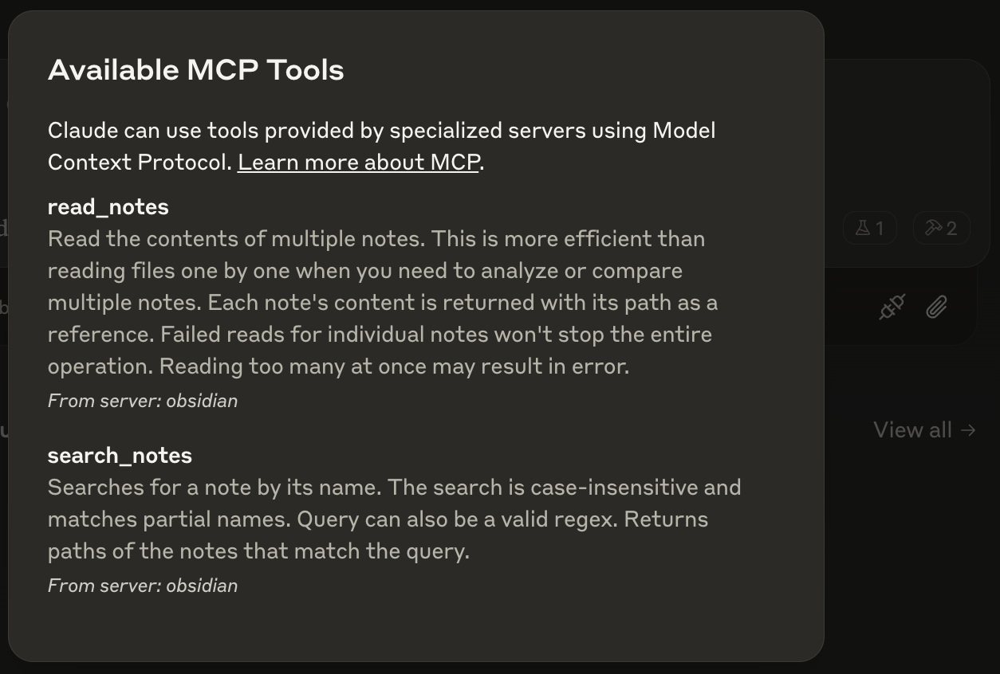

# Obsidian Model Context Protocol

This is a connector to allow Claude Desktop (or any MCP client) to read and search any directory containing Markdown notes (such as an Obsidian vault).

## Installation
Make sure Claude Desktop is installed.

Then, simply modify your Claude Desktop config located here:

`~/Library/Application\ Support/Claude/claude_desktop_config.json`

You can easily find this through the Claude Desktop menu:
1. Open Claude Desktop
2. Click Claude on the Mac menu bar
3. Click "Settings"
4. Click "Developer"

If you don't have this config, you can create an empty file at this location.

Add the following to the `mcpServers` array, replacing `<path-to-your-vault>` with the path to your Obsidian vault.

```json
{
    "mcpServers": {
        "markdown": {
            "command": "npx",
            "args": [
                "-y",
                "mcp-obsidian",
                "<path-to-your-vault>"
            ]
        }
    }
}
```

Then, start Claude Desktop and you should see the following MCP tools listed:

